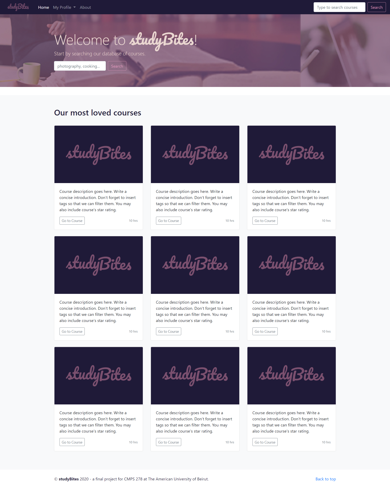
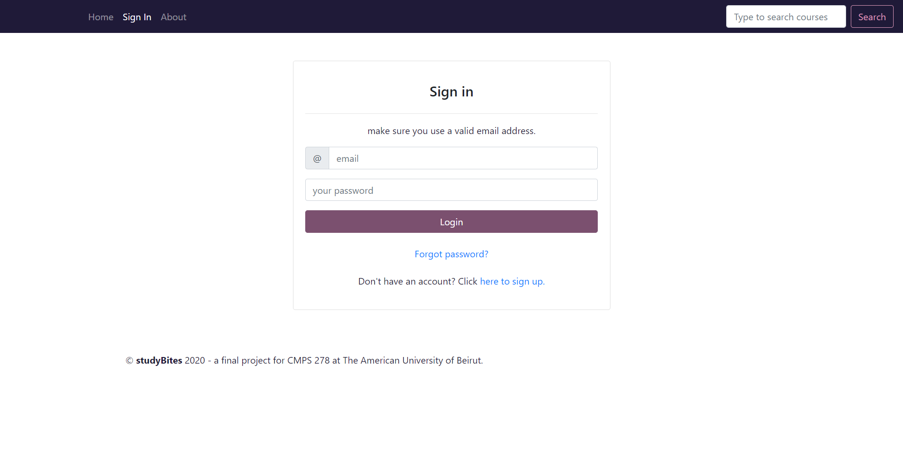

# studyBites-front-end
The Bootstrap-based front-end I designed for an online course platform.
Pages:
- Landing
- User authentication pages (login, registration and password reset)
- User profile
- About us
- 404 Not found
- User certificates/accomplishments
- Course page
- Course final exam/quiz
- Course support/feedback
- User courses list
- Settings

For a live demo, kindly visit https://itsmais.github.io/studyBites-front-end/

  
     
   

